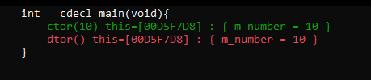

# Number
В данном репозитори представлен исходный код класса Number, реализующий 64 битное число, и набор инструментов для отслеживания поведения классов при различных операцих над объектами.

## Implementation
Над объектами типа Number можно делать все то, что и с обычными 64 битными знаковыми числами, однако каждая операция, в которой
принимает участие объект типа Number, фиксируется, а затем отображается в виде графа (генерация dot-файла) или сразу выводится на экран.

## Examples
Рассмотрим пример:
```c++
int main()
{
    #define VAR(type, name, value) type name(value, #name)
    {$1 $PRNT
        VAR(Number, a,  10);
    }
    return 0;
}
```
Приведенный выше код создает переменную типа Number с именем a, вызывая при этом конструктор Number(long long int). Макрос $1 требуется для записи в стек вызовов имени функции, данный макрос используется при создании графа, поэтому его следует указывать в начале тех функций, которые используют объекты класса Number. Второй макрос $PRNT отвечает за генерацию строки прототипа функции и дальнейшей её вывода на экран. Посмотрим как это все работает:


Для того, чтобы сгенерировать dot файл требуется еще вызвать функцию **dot::generateGraph(std::string filename)**:
```c++
int main()
{
    #define VAR(type, name, value) type name(value, #name)
    {$1 $PRNT
        VAR(Number, a,  10);
    }
    dot::generateGraph("example.dot");
    return 0;
}
```
После формирования изображения получим следующий граф:
<p align="center">
  
</p>

Усложним пример, добавив еще одну переменную:
```c++
int main()
{
    #define VAR(type, name, value) type name(value, #name)
    {$1 $PRNT
        VAR(Number, a,  10);
        VAR(Number, b,  a);
    }
    dot::generateGraph("example.dot");
    return 0;
}
```
В данном случае просто вызывается конструктор копирования, ничего необычного.


<p align="center">
  
</p>

Теперь, однако стоит пояснить что означают стрелки на графе. **Жирные красные стрелки** отображают последовательность операций, **пунктирные** показывают то, где данный объект используется, как видно из графа, конструктор копирования использует сам объект **a** для создания объекта **b**, ну и **точечные** стрелки, отображат цикл жизни объектов. В нашем примере каждый объект создается и сразу уничтожается, это скучно, поэтому добавим еще одну переменную!
```c++
int main()
{
    #define VAR(type, name, value) type name(value, #name)
    {$1 $PRNT
        VAR(Number, a,  10);
        VAR(Number, b,  20);
        VAR(Number, c,   0);
        c = a + b;
    }
    dot::generateGraph("example.dot");
    return 0;
}
```
Сначала вызывается 3 конструктора Number(long long int), затем оператор operator+(Number&,Number&), а в конце оператор operator=(Number&). Однако, не все так просто, если посмотреть на вывод, то обнаружим интересную вещь:


Графы становятся очень большими, поэтому изображения отдельно можно будет найти в папке [img](img/).
Интересно тут то, что оператор + сам вызывает конструктор, тем самым создавая временный объект. Который копируется в объект **c**.
Рассмотрим еще пару примеров: передача объекта по ссылке и по значению.
```c++
//Передаем объект по ссылке, аналогичный код множно написать и для передачи по значению
Number sqr(Number& a)
{$1 $PRNT
    return a * a;
}

int main()
{
    #define VAR(type, name, value) type name(value, #name)
    {$1 $PRNT
        VAR(Number, a,  10);
        VAR(Number, b,  0);
        b = sqr(a);
    }
    dot::generateGraph("example.dot");
    return 0;
}
```
Передача по значению       |  Передача по ссылке
:-------------------------:|:-------------------------:
  |  
        |  


Можно заметить, что при передаче по значению, передаваемый объект копируется, прежде чем будет использоваться дальше. В случае ссылочной передачи используется ровно тот объект, который был передан.

Ну и в самом конце посмотрим на граф действий для небольшой программы, которая вичисляет квадрат модуля целочисленного вектора:
```c++
Number sqr(Number a)
{$1 $PRNT
    return a * a;
}

Number squaredLenOfVector(const Number& a, const Number& b)
{$1 $PRNT
    return a * a + sqr(b);
}

int main()
{
    #define VAR(type, name, value) type name(value, #name)
    {$1 $PRNT
        VAR(Number, a,  10);
        VAR(Number, b,  10);
        VAR(Number, c, 0);
        c = squaredLenOfVector(a, b);
    }
    dot::generateGraph("example.dot");
    return 0;
}
```


